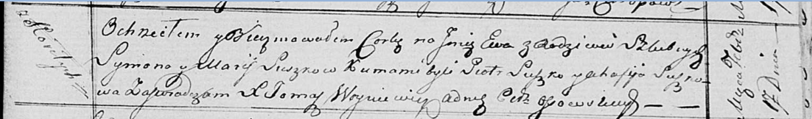

**Сушко Ева Сымонова (Suszkowna Ewa)**

17 февраля 1818 г -- крещение (НИАБ 136-13-894, лист 98, №6/1818-р
(ориг)).

**НИАБ 136-13-894:** Лист 98. **Метрическая запись №6/1818-р (ориг).**

{width="6.496527777777778in"
height="0.9581528871391076in"}

Осовская Покровская церковь. 17 февраля 1818 года. Метрическая запись о
крещении.

Suszkowna Ewa -- дочь родителей с деревни Горелое.

Suszko Symon -- отец.

Suszkowa Marija -- мать.

Suszko Piotr -- кум.

Suszkowa Ahafija -- кума.

Woyniewicz Tomasz -- ксёндз.
