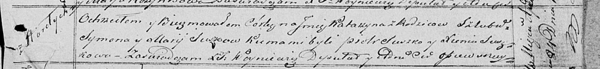

**Сушко Катерына Сымонова (Suszkowna Katarzyna)**

24 апреля 1821 г -- крещение (НИАБ 136-13-894, лист 106, №21/1821-р
(ориг)).

**НИАБ 136-13-894:** Лист 106. **Метрическая запись №21/1821-р (ориг).**

Осовская Покровская церковь. 24 апреля 1821 года. Метрическая запись о
крещении.

Suszkowna Katarzyna -- дочь родителей с деревни Горелое.

Suszko Symon -- отец.

Suszkowa Marija -- мать.

Suszko Piotr -- кум.

Suszkowa Xienia -- кума.

Woyniewicz Tomasz -- ксёндз.
