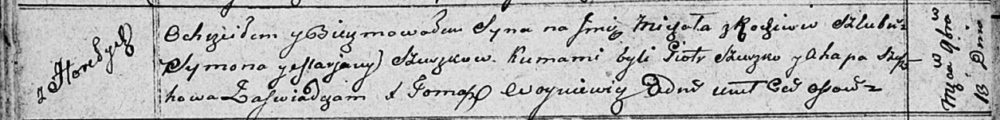

**Сушко Михал Сымонов (Suszko Michał)**

10? ноября 1810 г -- крещение (НИАБ 136-13-894, лист 79об, №57/1810-р
(ориг)).

**НИАБ 136-13-894:** Лист 79об. **Метрическая запись №57/1810-р
(ориг).**

{width="6.496527777777778in"
height="0.7818099300087489in"}

Осовская Покровская церковь. 10? ноября 1810 года. Метрическая запись о
крещении.

Szuszko Michał -- сын родителей с деревни Горелое.

Szuszko Symon -- отец.

Szuszkowa Marjana -- мать.

Szuszko Piotr -- кум.

Szuszkowa Ahapa -- кума.

Woyniewicz Tomasz -- ксёндз.
