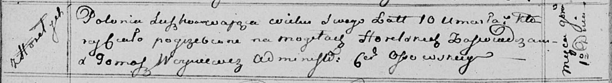

**Сушко Паланея Сымонова (Suszkowna Pałanieja Paraskewija)**

4 марта 1806 г -- крещение (НИАБ 136-13-894, лист 59об, №8/1806-р
(ориг)).

1 ноября 1815 г -- отпевание, умерла в возрасте 10 лет (НИАБ 136-13-919,
лист 29об, №24/1811-у (ориг)).

**НИАБ 136-13-894:** Лист 59об. **Метрическая запись №8/1806-р (ориг).**

Дедиловичская Покровская церковь. 4 марта 1806 года. Метрическая запись
о крещении.

Suszkowna Pałanieja Paraskiewija -- дочь родителей с деревни Горелое.

Suszko Symon -- отец.

Suszkowa Marya -- мать.

Suszko Piatruś -- кум.

Suszkowa Ahapa -- кума.

Jazgunowicz Antoni -- ксёндз.

**НИАБ 136-13-919:** Лист 29об. **Метрическая запись №24/1815-у
(ориг).**

Осовская униатская церковь. 1 ноября 1815 года. Метрическая запись об
отпевании.

Suszkowa Połonia -- умершая, 10 лет, с деревни Горелое, похоронена на
кладбище деревни Горелое.

Woyniewicz Tomasz -- ксёндз.
