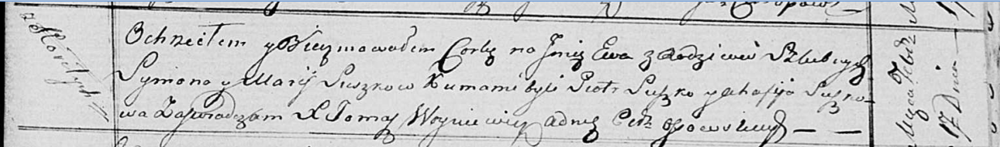

**Сушко Сымон (Suszko Symon)**

1 ноября 1803 г -- венчание с девкой Марыной Скакун с деревни Осово
(НИАБ 136-13-920, лист 9об, №9/1803-б (ориг)).

4 марта 1806 г -- крещение дочери Паланеи Параскевии (НИАБ 136-13-894,
лист 59об, №8/1806-р (ориг)).

25 апреля 1809 г -- крещение сына Юрки (НИАБ 136-13-894, лист 74,
№17/1809-р (ориг)).

10? ноября 1810 г -- крещение сына Михала (НИАБ 136-13-894, лист 79об,
№57/1810-р (ориг)).

17 февраля 1818 г -- крещение дочери Евы (НИАБ 136-13-894, лист 98,
№6/1818-р (ориг)).

24 апреля 1821 г -- крещение дочери Катерыны (НИАБ 136-13-894, лист 106,
№21/1821-р (ориг)).

**НИАБ 136-13-920:** Лист 9об. **Метрическая запись №9/1803-б (ориг).**

Дедиловичская Покровская церковь. 1 ноября 1803 года. Метрическая запись
о венчании.

Suszko Symon -- жених, молодой, с деревни Горелое.

Skakunowna Maryna -- невеста, девка, с деревни Осовo.

Suszko Mikołay -- свидетель, с деревни Горелое.

Suszko Gabriel -- свидетель, с деревни Горелое.

Jazgunowicz Antoni -- ксёндз.

**НИАБ 136-13-894:** Лист 59об. **Метрическая запись №8/1806-р (ориг).**

Дедиловичская Покровская церковь. 4 марта 1806 года. Метрическая запись
о крещении.

Suszkowna Pałanieja Paraskiewija -- дочь родителей с деревни Горелое.

Suszko Symon -- отец.

Suszkowa Marya -- мать.

Suszko Piatruś -- кум.

Suszkowa Ahapa -- кума.

Jazgunowicz Antoni -- ксёндз.

**НИАБ 136-13-894:** Лист 74. **Метрическая запись №17/1809-р (ориг).**

Дедиловичская Покровская церковь. 25 апреля 1809 года. Метрическая
запись о крещении .

Suszko Jurka -- сын родителей с деревни Горелое.

Suszko Symon -- отец.

Suszkowa Marya -- мать.

Suszko Piatruś -- кум.

Suszko Ahapa -- кума.

Jazgunowicz Antoni -- ксёндз.

**НИАБ 136-13-894:** Лист 79об. **Метрическая запись №57/1810-р
(ориг).**

Осовская Покровская церковь. 10? ноября 1810 года. Метрическая запись о
крещении.

Szuszko Michał -- сын родителей с деревни Горелое.

Szuszko Symon -- отец.

Szuszkowa Marjana -- мать.

Szuszko Piotr -- кум.

Szuszkowa Ahapa -- кума.

Woyniewicz Tomasz -- ксёндз.

**НИАБ 136-13-894:** Лист 98. **Метрическая запись №6/1818-р (ориг).**

Осовская Покровская церковь. 17 февраля 1818 года. Метрическая запись о
крещении.

Suszkowna Ewa -- дочь родителей с деревни Горелое.

Suszko Symon -- отец.

Suszkowa Marija -- мать.

Suszko Piotr -- кум.

Suszkowa Ahafija -- кума.

Woyniewicz Tomasz -- ксёндз.

**НИАБ 136-13-894:** Лист 106. **Метрическая запись №21/1821-р (ориг).**

Осовская Покровская церковь. 24 апреля 1821 года. Метрическая запись о
крещении.

Suszkowna Katarzyna -- дочь родителей с деревни Горелое.

Suszko Symon -- отец.

Suszkowa Marija -- мать.

Suszko Piotr -- кум.

Suszkowa Xienia -- кума.

Woyniewicz Tomasz -- ксёндз.
