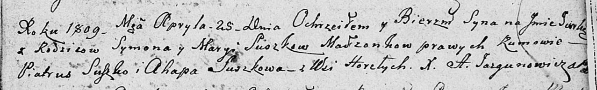

**Сушко Юрка Сымонов (Suszko Jurka)**

25 апреля 1809 г -- крещение (НИАБ 136-13-894, лист 74, №17/1809-р
(ориг)).

**НИАБ 136-13-894:** Лист 74. **Метрическая запись №17/1809-р (ориг).**

Дедиловичская Покровская церковь. 25 апреля 1809 года. Метрическая
запись о крещении .

Suszko Jurka -- сын родителей с деревни Горелое.

Suszko Symon -- отец.

Suszkowa Marya -- мать.

Suszko Piatruś -- кум.

Suszko Ahapa -- кума.

Jazgunowicz Antoni -- ксёндз.
