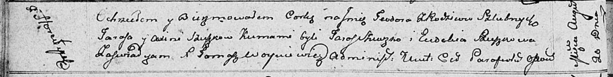

**Сушко Тарас (Suszko Taras)**

20 августа 1811 г -- крещение дочери Тодоры (НИАБ 136-13-894, лист 81об,
№42/1811-р (ориг)).

**НИАБ 136-13-894:** Лист 81об. **Метрическая запись №42/1811-р
(ориг).**

Осовская Покровская церковь. 20 августа 1811 года. Метрическая запись о
крещении.

Szuszkowna Teodora -- дочь родителей с деревни Горелое.

Szuszko Taras -- отец.

Szuszkowa Axinia -- мать.

Szuszko Taras -- кум.

Szuszkowa Eudokija -- кума.

Woyniewicz Tomasz -- ксёндз.
