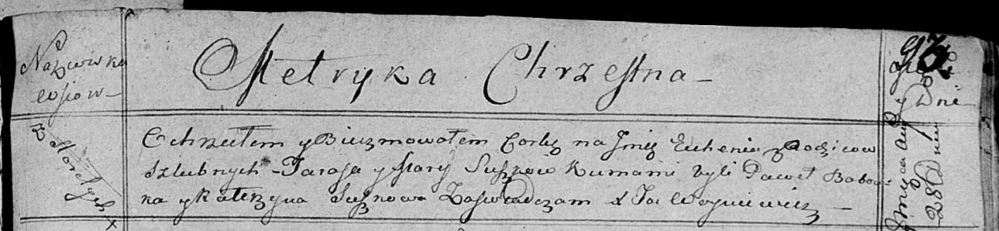

**Сушко Евгения Тарасова (Suszkowna Euhenija)**

28 августа 1815 г -- крещение (НИАБ 136-13-894, лист 93, №35/1815-р
(ориг)).

**НИАБ 136-13-894:** Лист 93. **Метрическая запись №35/1815-р (ориг).**

Осовская Покровская церковь. 28 августа 1815 года. Метрическая запись о
крещении.

Suszkowna Euhenija -- дочь родителей с деревни Горелое.

Suszko Taras -- отец.

Suszkowa Marija -- мать.

Babouka Paweł -- кум.

Suszkowa Katerzyna -- кума.

Woyniewicz Tomasz -- ксёндз.
