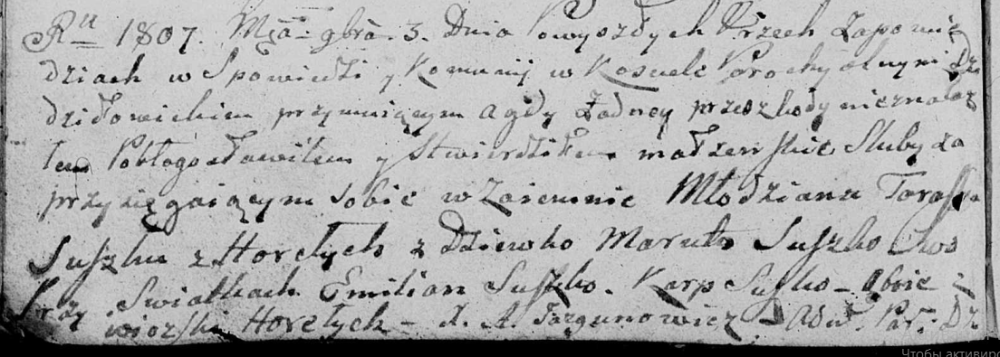
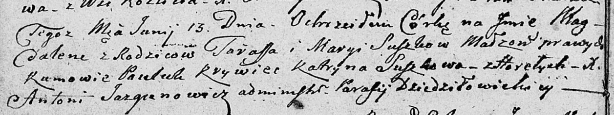
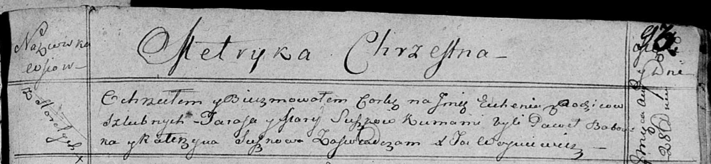

**Сушко (Сушко) Марыя, Марута (Suszkowa Marya, Maruta z Suszkow)**

3 ноября 1807 г -- венчание с молодым Тарасом Сушко с деревни Горелое
(НИАБ 136-13-920, лист 12об, №8/1807-б (ориг)).

13 июня 1809 г -- крещение дочери Магдалены (НИАБ 136-13-894, лист 74об,
№30/1809-р (ориг)).

28 августа 1815 г -- крещение дочери Евгении (НИАБ 136-13-894, лист 93,
№35/1815-р (ориг)).

**НИАБ 136-13-920:** Лист 12об. **Метрическая запись №8/1807-б (ориг).**

Дедиловичская Покровская церковь. 3 ноября 1807 года. Метрическая запись
о венчании.

Suszko Taras -- жених, молодой, с деревни Горелое.

Suszko Maruta -- невеста, девка.

Suszko Emilian -- свидетель, с деревни Горелое.

Suszko Karp -- свидетель, с деревни Горелое.

Jazgunowicz Antoni -- ксёндз.

**НИАБ 136-13-894:** Лист 74об. **Метрическая запись №30/1809-р
(ориг).**

Дедиловичская Покровская церковь. 13 июня 1809 года. Метрическая запись
о крещении.

Suszkowna Magdalena -- дочь родителей с деревни Горелое.

Suszko Taras -- отец.

Suszkowa Marya -- мать.

Krywec Pauluk -- кум.

Suszkowa Katryna -- кума.

Jazgunowicz Antoni -- ксёндз.

**НИАБ 136-13-894:** Лист 93. **Метрическая запись №35/1815-р (ориг).**

Осовская Покровская церковь. 28 августа 1815 года. Метрическая запись о
крещении.

Suszkowna Euhenija -- дочь родителей с деревни Горелое.

Suszko Taras -- отец.

Suszkowa Marija -- мать.

Babouka Paweł -- кум.

Suszkowa Katerzyna -- кума.

Woyniewicz Tomasz -- ксёндз.
