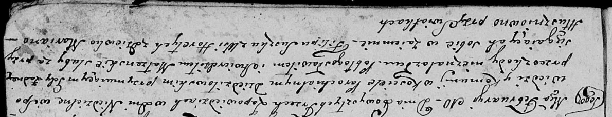
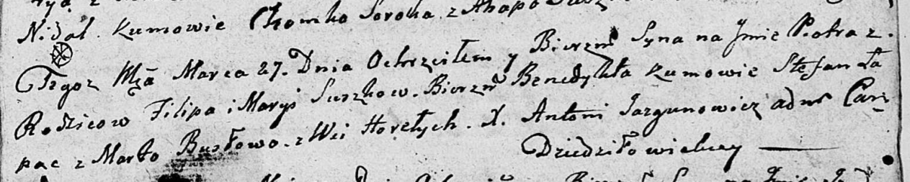
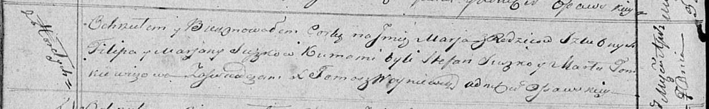
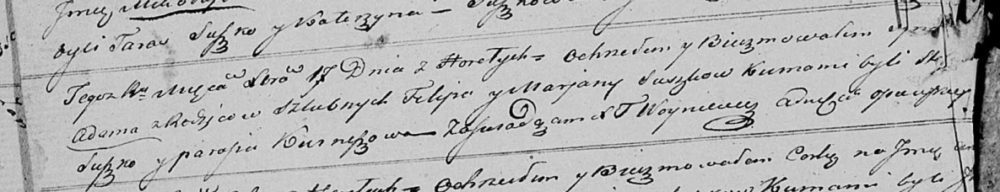

**Сушко (Глушень) Марыя, Марьяна (Suszkowa Marya, Marjana z Hłuszniow)**

10 февраля 1807 г -- венчание с Филипом Сушко с деревни Горелое (НИАБ
136-13-894, лист 12, №3/1807-б (ориг)).

27 марта 1810 г -- крещение сына Петра Бенедыкта (НИАБ 136-13-894, лист
77, №15/1810-р (ориг)).

7 января 1817 г -- крещение дочери Татьяны (НИАБ 136-13-894, лист 95,
№1/1817-р (ориг)).

7 апреля 1819 г -- крещение дочери Марьи (НИАБ 136-13-894, лист 100об,
№19/1819-р (ориг)).

17 декабря 18210 г -- крещение сына Адама (НИАБ 136-13-894, лист 107об,
№54/1821-р (ориг)).

**НИАБ 136-13-920:** Лист 12. **Метрическая запись №3/1807-б (ориг).**

Дедиловичская Покровская церковь. 10 февраля 1807 года. Метрическая
запись о венчании.

Suszko Filip -- жених, с деревни Горелое.

Hłuszniowna Marjana -- невеста, девка.

**НИАБ 136-13-894:** Лист 77. **Метрическая запись №15/1810-р (ориг).**

Дедиловичская Покровская церковь. 27 марта 1810 года. Метрическая запись
о крещении.

Suszko Piotr Benedykt -- сын родителей с деревни Горелое.

Suszko Filip -- отец.

Suszkowa Marya -- мать.

Łapać Stefan -- кум.

Busłowa Marta -- кума.

Jazgunowicz Antoni -- ксёндз.

**НИАБ 136-13-894:** Лист 95. **Метрическая запись №1/1817-р (ориг).**

Осовская униатская церковь. 7 января 1817 года. Метрическая запись о
крещении.

Suszkowna Tеciana -- дочь родителей с деревни Горелое.

Suszko Filip -- отец.

Suszkowa Marjana -- мать.

Suszko Stefan -- кум.

Busłowa Marta -- кума.

Woyniewicz Tomasz -- ксёндз.

**НИАБ 136-13-894:** Лист 100об. **Метрическая запись №19/1819-р
(ориг).**

Осовская Покровская церковь. 7 апреля 1819 года. Метрическая запись о
крещении.

Suszkowna Marja -- дочь родителей с деревни Горелое.

Suszko Filip -- отец.

Suszkowa Marjana -- мать.

Suszko Stefan -- кум.

Tomkowiczowa Marta -- кума.

Woyniewicz Tomasz -- ксёндз.

**НИАБ 136-13-894:** 107об. **Метрическая запись №54/1821-р (ориг).**

Осовская Покровская церковь. 17 декабря 1821 года. Метрическая запись о
крещении.

Suszko Adam -- сын родителей с деревни Горелое.

Suszko Filip -- отец.

Suszkowa Marjana -- мать.

Suszko Stefan? -- кум.

Kurneszowa Parasia -- кума.

Woyniewicz Tomasz -- ксёндз.
