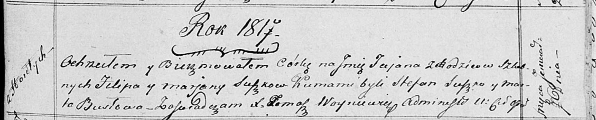

**Сушко Марья Филипова (Suszkowna Marja)**

7 апреля 1819 г -- крещение (НИАБ 136-13-894, лист 100об, №19/1819-р
(ориг)).

**НИАБ 136-13-894:** Лист 100об. **Метрическая запись №19/1819-р
(ориг).**

{width="6.496527777777778in"
height="1.0091108923884515in"}

Осовская Покровская церковь. 7 апреля 1819 года. Метрическая запись о
крещении.

Suszkowna Marja -- дочь родителей с деревни Горелое.

Suszko Filip -- отец.

Suszkowa Marjana -- мать.

Suszko Stefan -- кум.

Tomkowiczowa Marta -- кума.

Woyniewicz Tomasz -- ксёндз.
