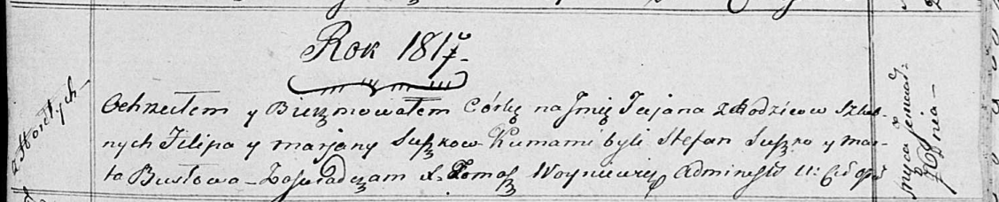

**Сушко Пётр Филипов (Suszko Piotr Benedykt)**

27 марта 1810 г -- крещение (НИАБ 136-13-894, лист 77, №15/1810-р
(ориг)).

**НИАБ 136-13-894:** Лист 77. **Метрическая запись №15/1810-р (ориг).**

{width="6.496527777777778in"
height="1.3014512248468941in"}

Дедиловичская Покровская церковь. 27 марта 1810 года. Метрическая запись
о крещении.

Suszko Piotr Benedykt -- сын родителей с деревни Горелое.

Suszko Filip -- отец.

Suszkowa Marya -- мать.

Łapać Stefan -- кум.

Busłowa Marta -- кума.

Jazgunowicz Antoni -- ксёндз.
