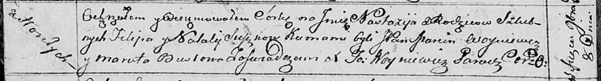

**Сушко Филип (Suszko Filip)**

8 ноября 1813 г -- крещение дочери Настасьи (НИАБ 136-13-894, лист 87об,
№36/1813-р (ориг)).

**НИАБ 136-13-894:** Лист 87об. **Метрическая запись №36/1813-р
(ориг).**

Осовская Покровская церковь. 8 ноября 1813 года. Метрическая запись о
крещении.

Suszkowna Nastazyja -- дочь родителей с деревни Горелое.

Suszko Filip -- отец.

Suszkowa Natalija -- мать.

Woyniewicz Marcin, JP -- кум, шляхтич.

Busłowa Maruta -- кума.

Woyniewicz Tomasz -- ксёндз.
