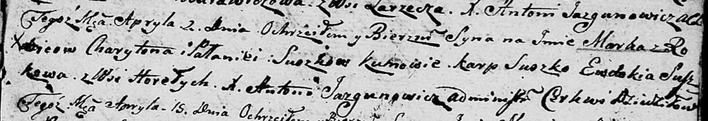

**Сушко Паланея (Suszkowa Pałanieja)**

2 апреля 1806 г -- крещение сына Марка (НИАБ 136-13-894, лист 60,
№16/1806-р (ориг)).

**НИАБ 136-13-894:** Лист 60. **Метрическая запись №16/1806-р (ориг).**

Дедиловичская Покровская церковь. 2 апреля 1806 года. Метрическая запись
о крещении.

Suszko Marko -- сын родителей с деревни Горелое.

Suszko Charyton -- отец.

Suszkowa Pałanieja -- мать.

Suszko Karp -- кум.

Suszkowa Ewdokija -- кума.

Jazgunowicz Antoni -- ксёндз.
