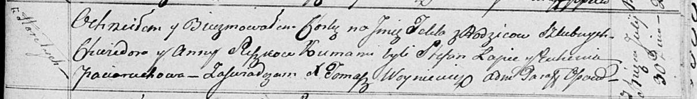

**Сушко Грыгор Хведоров (Suszko Hryhor)**

1 февраля 1820 г -- крещение (НИАБ 136-13-894, лист 103об, №5/1820-р
(ориг)).

**НИАБ 136-13-894:** Лист 103об. **Метрическая запись №5/1820-р
(ориг).**

{width="6.496527777777778in"
height="0.7536482939632546in"}

Осовская Покровская церковь. 1 февраля 1820 года. Метрическая запись о
крещении.

Suszko Hryhor -- сын родителей с деревни Горелое.

Suszko Chwiedor -- отец.

Suszkowa Anna -- мать.

Łapieć Stefan -- кум.

Paciaruchowa Euhenija -- кума.

Woyniewicz Tomasz -- ксёндз.
