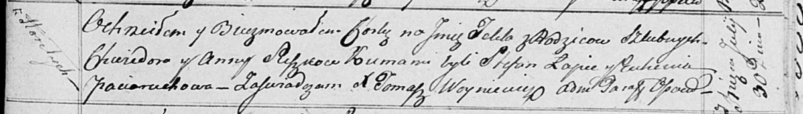

**Сушко Текля Хведорова (Suszkowna Tekla)**

30 июля 1817 г -- крещение (НИАБ 136-13-894, лист 97, №48/1817-р
(ориг)).

**НИАБ 136-13-894:** Лист 97. **Метрическая запись №48/1817-р (ориг).**

Осовская Покровская церковь. 30 июля 1817 года. Метрическая запись о
крещении.

Suszkowna Tekla -- дочь родителей с деревни Горелое.

Suszko Chwiedor -- отец.

Suszkowa Anna -- мать.

Łapieć Stefan -- кум.

Paciaruchowa Euhenija -- кума.

Woyniewicz Tomasz -- ксёндз.
