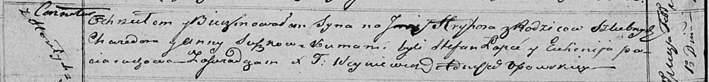

**Сушко Хведор (Suszko, Szusza Chwiedor)**

12 ноября 1811 г -- венчание с девкой Анной Хозан с деревни Дедиловичи
(НИАБ 136-13-920, лист 18, №11/1811-б (ориг)).

30 июля 1817 г -- крещение дочери Текли (НИАБ 136-13-894, лист 97,
№48/1817-р (ориг)).

1 февраля 1820 г -- крещение сына Грыгора (НИАБ 136-13-894, лист 103об,
№5/1820-р (ориг)).

**НИАБ 136-13-920:** Лист 18. **Метрическая запись №11/1811-б (ориг).**

{width="6.496527777777778in"
height="1.414767060367454in"}

Осовская Покровская церковь. 12 ноября 1811 года. Метрическая запись о
венчании.

Szusza Chwiedor -- жених, молодой, парафии Осовской, с деревни Горелое.

Chozanowna Anna -- невеста, девка, парафии Осовской, местечко
Дедиловичи.

Kuryłyn Dzienis -- свидетель.

Jacuk Jozef -- свидетель.

Woyniewicz Tomasz -- ксёндз.

**НИАБ 136-13-894:** Лист 97. **Метрическая запись №48/1817-р (ориг).**

{width="6.496527777777778in"
height="0.9226159230096238in"}

Осовская Покровская церковь. 30 июля 1817 года. Метрическая запись о
крещении.

Suszkowna Tekla -- дочь родителей с деревни Горелое.

Suszko Chwiedor -- отец.

Suszkowa Anna -- мать.

Łapieć Stefan -- кум.

Paciaruchowa Euhenija -- кума.

Woyniewicz Tomasz -- ксёндз.

**НИАБ 136-13-894:** Лист 103об. **Метрическая запись №5/1820-р
(ориг).**

{width="6.496527777777778in"
height="0.7536482939632546in"}

Осовская Покровская церковь. 1 февраля 1820 года. Метрическая запись о
крещении.

Suszko Hryhor -- сын родителей с деревни Горелое.

Suszko Chwiedor -- отец.

Suszkowa Anna -- мать.

Łapieć Stefan -- кум.

Paciaruchowa Euhenija -- кума.

Woyniewicz Tomasz -- ксёндз.
