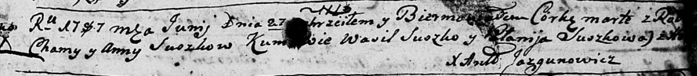
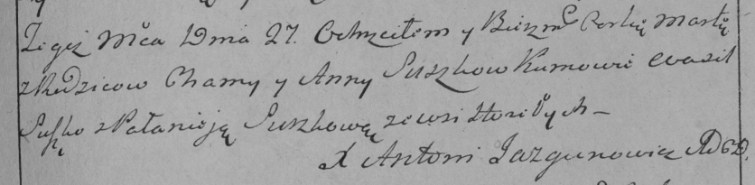

**Сушко Марта Хомова (Suszkowna Marta)**

27 июня 1787 г -- крещение дочери Марты (НИАБ 136-13-894, лист 2,
№24/1787-р (ориг)), (РГИА 823-2-18, лист 234, №16/1787-р (коп))

**НИАБ 136-13-894:** Лист 2. **Метрическая запись №24/1787-р (ориг).**

Дедиловичская Покровская церковь. 27 июня 1787 года. Метрическая запись
о крещении.

Suszkowna Marta - дочь.

Suszko Chama -- отец.

Suszkowa Anna -- мать.

Suszko Wasil - кум.

Suszkowa Połonija - кума.

Jazgunowicz Antoniusz -- ксёндз.

**РГИА 823-2-18:** Лист 234. **Метрическая запись №16/1787-р (коп).**

Дедиловичская Покровская церковь. 27 июня 1787 года. Метрическая запись
о крещении.

Suszkowna Marta -- дочь родителей с деревни Горелое.

Suszko Chama -- отец.

Suszkowa Anna -- мать.

Suszko Wasil -- кум.

Suszkowa Pałanieja - кума.

Jazgunowicz Antoni -- ксёндз.
