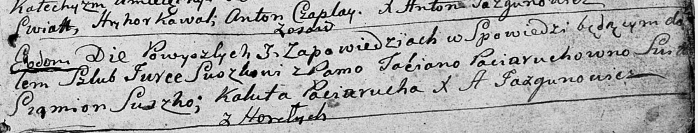

**Сушко Юрка (Suszkowa Taćiana z Paciaruchow)**

12 января 1791 г -- венчание с Юркой Сушко с деревни Горелое (НИАБ
136-13-894, лист 69, №3/1791-б (об)).

**НИАБ 136-13-894:** Лист 69. **Метрическая запись №3/1791-б (ориг).**

{width="6.496527777777778in"
height="1.2424464129483814in"}

Дедиловичская Покровская церковь. 12 января 1791 года. Метрическая
запись о венчании.

Suszko Jurka -- жених, с деревни Горелое.

Paciaruchowna Taćiana -- невеста.

Suszko Siamion -- свидетель.

Paciarucha Kaluta -- свидетель.

Jazgunowicz Antoni -- ксёндз.
