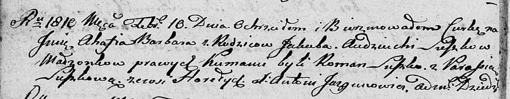

**Сушко Агафия Якубова (Suszkowna Ahafia Barbara)**

10 февраля 1810 г -- крещение (НИАБ 136-13-894, лист 76об, №7/1810-р
(об)).

**НИАБ 136-13-894:** Лист 76об. **Метрическая запись №7/1810-р (ориг).**

{width="6.496527777777778in"
height="1.2699376640419948in"}

Дедиловичская Покровская церковь. 10 февраля 1810 года. Метрическая
запись о крещении.

Suszkowna Ahafia Barbara -- сын родителей из деревни Горелое.

Suszko Jakub -- отец.

Suszkowa Audziucha -- мать.

Suszko Roman -- кум.

Suszkowa Parasia -- кума.

Jazgunowicz Antoni -- ксёндз.
