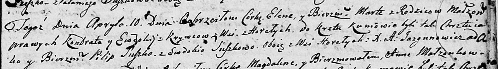

**Сушко Евдокия (Suszkowa Ewdokija, Audziucha)**

26 апреля 1803 г -- крещение сына Сымона Базыля (НИАБ 136-13-894, лист
50, №16/1803-р (об)).

23 января 1805 г -- возможно, крестная мать у Марьяны Агафии, дочери
Курнешов Ермака и Юстыны с деревни Домашковичи (НИАБ 136-13-894, лист
56об, №8/1805-р (ориг)).

10 апреля 1805 г -- возможно, крестная мать Елены Марты, дочери Кривцов
Кондрата и Евдокии с деревни Горелое (НИАБ 136-13-894, лист 57,
№21/1805-р (ориг)).

4 марта 1807 г -- крещение дочери Марьяны (НИАБ 136-13-894, лист 62,
№13/1807-р (об)).

10 февраля 1810 г -- крещение дочери Агафии Варвары (НИАБ 136-13-894,
лист 76об, №7/1810-р (об)).

30 марта 1813 г -- крещение дочери ? (НИАБ 136-13-894, лист 86,
№6/1813-р (об)).

**НИАБ 136-13-894:** Лист 50. **Метрическая запись №16/1803-р (ориг).**

{width="6.496527777777778in"
height="1.9209984689413824in"}

Дедиловичская Покровская церковь. 26 апреля 1803 года. Метрическая
запись о крещении.

Suszko Symon Bazyli -- сын родителей с деревни Горелое.

Suszko Jakub -- отец.

Suszkowa Ewdokija -- мать.

Suszko Łukjan -- кум, с деревни Горелое.

Suszkowa Parasia -- кума, с деревни Горелое.

Jazgunowicz Antoni -- ксёндз.

**НИАБ 136-13-894:** Лист 56об. **Метрическая запись №8/1805-р (ориг).**

{width="6.496527777777778in"
height="1.2612204724409448in"}

Дедиловичская Покровская церковь. 23 января 1805 года. Метрическая
запись о крещении.

Kurneszowna Marjana Ahafia -- дочь родителей с деревни Домашковичи.

Kurnesz Jermak -- отец.

Kurneszowa Justyna -- мать.

Suszko Symon -- кум.

Suszkowa Ewdokija -- кума, с деревни Горелое.

Jazgunowicz Antoni -- ксёндз.

Лист 57. **Метрическая запись №21/1805-р (ориг).**

{width="6.496527777777778in"
height="0.9098764216972879in"}

Дедиловичская Покровская церковь. 10 апреля 1805 года. Метрическая
запись о крещении.

Krywcowna Elena Marta -- дочь родителей с деревни Горелое.

Kryweć Kondrat -- отец.

Krywcowa Ewdokija -- мать.

Suszko Pilip -- кум, с деревни Горелое.

Suszkowa Ewdokija -- кума, с деревни Горелое.

Jazgunowicz Antoni -- ксёндз.

**НИАБ 136-13-894:** Лист 62. **Метрическая запись №13/1807-р (ориг).**

{width="6.496527777777778in"
height="0.9735739282589676in"}

Дедиловичская Покровская церковь. 4 марта 1807 года. Метрическая запись
о крещении.

Suszkowna Marjana -- дочь родителей с деревни Горелое.

Suszko Jakub -- отец.

Suszkowa Ewdokija -- мать.

Suszko Roman -- кум, с деревни Горелое.

Suszkowa Parasia -- кума, с деревни Горелое.

Jazgunowicz Antoni -- ксёндз.

**НИАБ 136-13-894:** Лист 76об. **Метрическая запись №7/1810-р (ориг).**

{width="6.496527777777778in"
height="1.2699376640419948in"}

Дедиловичская Покровская церковь. 10 февраля 1810 года. Метрическая
запись о крещении.

Suszkowna Ahafia Barbara -- сын родителей из деревни Горелое.

Suszko Jakub -- отец.

Suszkowa Audziucha -- мать.

Suszko Roman -- кум.

Suszkowa Parasia -- кума.

Jazgunowicz Antoni -- ксёндз.

**НИАБ 136-13-894:** Лист 86. **Метрическая запись №6/1813-р (ориг).**

{width="6.496527777777778in"
height="0.8803740157480315in"}

Осовская Покровская церковь. 30 марта 1813 года. Метрическая запись о
крещении.

Suszkowna \...a\...ita -- дочь родителей с деревни Горелое.

Suszko Jakub -- отец.

Suszkowa Eudokija -- мать.

Suszko Roman -- кум.

Suszkowa Parasia -- кума.

Woyniewicz Tomasz -- ксёндз.
