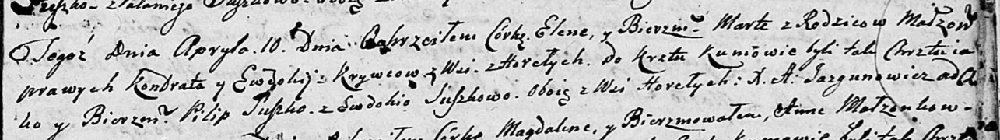

**Сушко Марьяна Якубова (Suszkowna Marjana)**

4 марта 1807 г -- крещение (НИАБ 136-13-894, лист 62, №13/1807-р (об)).

**НИАБ 136-13-894:** Лист 62. **Метрическая запись №13/1807-р (ориг).**

{width="6.496527777777778in"
height="0.9735739282589676in"}

Дедиловичская Покровская церковь. 4 марта 1807 года. Метрическая запись
о крещении.

Suszkowna Marjana -- дочь родителей с деревни Горелое.

Suszko Jakub -- отец.

Suszkowa Ewdokija -- мать.

Suszko Roman -- кум, с деревни Горелое.

Suszkowa Parasia -- кума, с деревни Горелое.

Jazgunowicz Antoni -- ксёндз.
