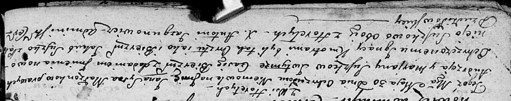
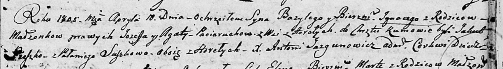
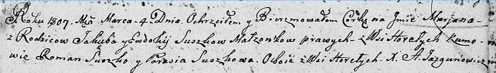
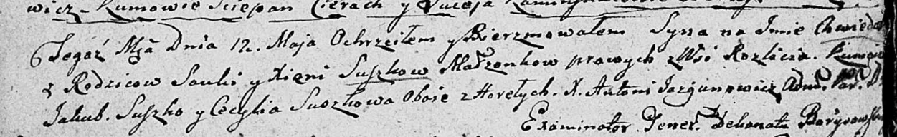
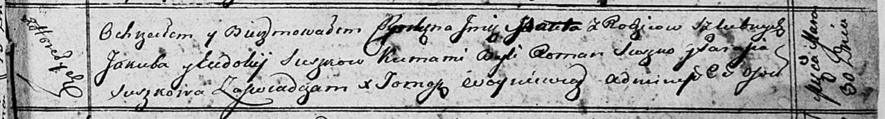

**Сушко Якуб (Suszko Jakub)**

26 апреля 1803 г -- крещение сына Сымона Базыля (НИАБ 136-13-894, лист
50, №16/1803-р (об)).

30 мая 1803 г -- возможно, крестный отец Яна Игнация, сына Сушков Андрея
и Марьяны с деревни Горелое (НИАБ 136-13-894, лист 50об, №23/1803-р
(ориг)).

10 апреля 1805 г -- возможно, крестный отец Базыля Игнацыя, сына Поцерух
Иосифа и Зыновии с деревни Горелое (НИАБ 136-13-894, лист 57, №20/1805-р
(ориг)).

4 марта 1807 г -- крещение дочери Марьяны (НИАБ 136-13-894, лист 62,
№13/1807-р (об)).

12 мая 1807 г -- возможно, крестный отец Хведора, сына Сушков Савы и
Ксени с деревни Разлитье (НИАБ 136-13-894, лист 62об, №25/1807-р
(ориг)).

10 февраля 1810 г -- крещение дочери Агафии Варвары (НИАБ 136-13-894,
лист 76об, №7/1810-р (об)).

30 марта 1813 г -- крещение дочери ? (НИАБ 136-13-894, лист 86,
№6/1813-р (об)).

**НИАБ 136-13-894:** Лист 50. **Метрическая запись №16/1803-р (ориг).**

Дедиловичская Покровская церковь. 26 апреля 1803 года. Метрическая
запись о крещении.

Suszko Symon Bazyli -- сын родителей с деревни Горелое.

Suszko Jakub -- отец.

Suszkowa Ewdokija -- мать.

Suszko Łukjan -- кум, с деревни Горелое.

Suszkowa Parasia -- кума, с деревни Горелое.

Jazgunowicz Antoni -- ксёндз.

**НИАБ 136-13-894:** Лист 50об. **Метрическая запись №23/1803-р
(ориг).**

Дедиловичская Покровская церковь. 30 мая 1803 года. Метрическая запись о
крещении.

Suszko Jan Jgnacy -- сын родителей с деревни Горелое.

Suszko Andrzey -- отец.

Suszkowa Marjana -- мать.

Suszko Jakub -- кум, с деревни Горелое.

Suszkowa Pałanieja -- кума, с деревни Горелое.

Jazgunowicz Antoni -- ксёндз.

**НИАБ 136-13-894:** Лист 57. **Метрическая запись №20/1805-р (ориг).**

Дедиловичская Покровская церковь. 10 апреля 1805 года. Метрическая
запись о крещении.

Paciarucha Bazyli Jhnacy -- сын родителей с деревни Горелое.

Paciarucha Jozef -- отец.

Paciaruchowa Agata -- мать.

Suszko Jakub -- кум, с деревни Горелое.

Suszkowa Pałanieja -- кума, с деревни Горелое.

Jazgunowicz Antoni -- ксёндз.

**НИАБ 136-13-894:** Лист 62. **Метрическая запись №13/1807-р (ориг).**

Дедиловичская Покровская церковь. 4 марта 1807 года. Метрическая запись
о крещении.

Suszkowna Marjana -- дочь родителей с деревни Горелое.

Suszko Jakub -- отец.

Suszkowa Ewdokija -- мать.

Suszko Roman -- кум, с деревни Горелое.

Suszkowa Parasia -- кума, с деревни Горелое.

Jazgunowicz Antoni -- ксёндз.

**НИАБ 136-13-894:** Лист 62об. **Метрическая запись №25/1807-р
(ориг).**

Дедиловичская Покровская церковь. 12 мая 1807 года. Метрическая запись о
крещении.

Suszko Chwiedor -- сын родителей с деревни Разлитье.

Suszko Sauka -- отец.

Suszkowa Xienia -- мать.

Suszko Jakub -- кум, с деревни Горелое.

Suszkowa Cecylia -- кума, с деревни Горелое.

Jazgunowicz Antoni -- ксёндз.

**НИАБ 136-13-894:** Лист 76об. **Метрическая запись №7/1810-р (ориг).**

Дедиловичская Покровская церковь. 10 февраля 1810 года. Метрическая
запись о крещении.

Suszkowna Ahafia Barbara -- сын родителей из деревни Горелое.

Suszko Jakub -- отец.

Suszkowa Audziucha -- мать.

Suszko Roman -- кум.

Suszkowa Parasia -- кума.

Jazgunowicz Antoni -- ксёндз.

**НИАБ 136-13-894:** Лист 86. **Метрическая запись №6/1813-р (ориг).**

Осовская Покровская церковь. 30 марта 1813 года. Метрическая запись о
крещении.

Suszkowna \...a\...ita -- дочь родителей с деревни Горелое.

Suszko Jakub -- отец.

Suszkowa Eudokija -- мать.

Suszko Roman -- кум.

Suszkowa Parasia -- кума.

Woyniewicz Tomasz -- ксёндз.
