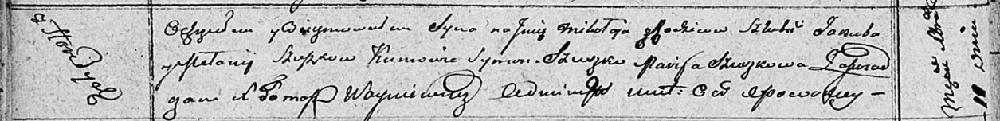

**Сушко Мелания (Szuszkowa Mełanija)**

11 декабря 1810 г -- крещение сына Миколая (НИАБ 136-13-894, лист 79об,
№62/1810-р (об)).

**НИАБ 136-13-894:** Лист 79об. **Метрическая запись №62/1810-р
(ориг).**

Осовская Покровская церковь. 11 декабря 1810 года. Метрическая запись о
крещении.

Szuszko Mikołay -- сын родителей с деревни Горелое.

Szuszko Jakub -- отец.

Szuszkowa Mełanija -- мать.

Szuszko Symon -- кум.

Szuszkowa Marija -- кума.

Woyniewicz Tomasz -- ксёндз.
