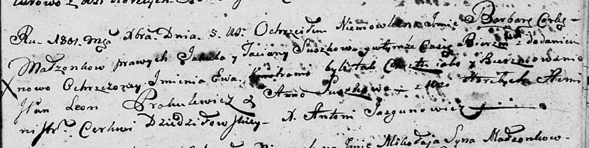

**Сушко Варвара Якубова (Suszkowna Barbara Ewa)**

5 декабря 1801 г -- крещение (НИАБ 136-13-894, лист 45, №32/1801-р
(об)).

**НИАБ 136-13-894:** Лист 45. **Метрическая запись №32/1801-р (ориг).**

Дедиловичская Покровская церковь. 5 декабря 1801 года. Метрическая
запись о крещении.

Suszkowna Barbara Ewa -- дочь родителей с деревни Горелое.

Suszko Jakub -- отец.

Suszkowa Taciana -- мать.

Prokulewicz Leon, JP -- кум, шляхтич.

Suszkowa Anna -- кума.

Jazgunowicz Antoni -- ксёндз.
