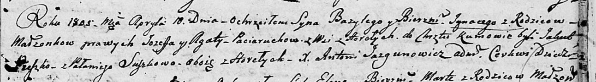

**Сушко Якуб (Suszko Jakub)**

5 декабря 1801 г -- крещение дочери Варвары (НИАБ 136-13-894, лист 45,
№32/1801-р (об)).

30 мая 1803 г -- возможно, крестный отец Яна Игнация, сына Сушков Андрея
и Марьяны с деревни Горелое (НИАБ 136-13-894, лист 50об, №23/1803-р
(ориг)).

10 апреля 1805 г -- возможно, крестный отец Базыля Игнацыя, сына Поцерух
Иосифа и Зыновии с деревни Горелое (НИАБ 136-13-894, лист 57, №20/1805-р
(ориг)).

12 мая 1807 г -- возможно, крестный отец Хведора, сына Сушков Савы и
Ксени с деревни Разлитье (НИАБ 136-13-894, лист 62об, №25/1807-р
(ориг)).

**НИАБ 136-13-894:** Лист 45. **Метрическая запись №32/1801-р (ориг).**

Дедиловичская Покровская церковь. 5 декабря 1801 года. Метрическая
запись о крещении.

Suszkowna Barbara Ewa -- дочь родителей с деревни Горелое.

Suszko Jakub -- отец.

Suszkowa Taciana -- мать.

Prokulewicz Leon, JP -- кум, шляхтич.

Suszkowa Anna -- кума.

Jazgunowicz Antoni -- ксёндз.

**НИАБ 136-13-894:** Лист 50об. **Метрическая запись №23/1803-р
(ориг).**

Дедиловичская Покровская церковь. 30 мая 1803 года. Метрическая запись о
крещении.

Suszko Jan Jgnacy -- сын родителей с деревни Горелое.

Suszko Andrzey -- отец.

Suszkowa Marjana -- мать.

Suszko Jakub -- кум, с деревни Горелое.

Suszkowa Pałanieja -- кума, с деревни Горелое.

Jazgunowicz Antoni -- ксёндз.

**НИАБ 136-13-894:** Лист 57. **Метрическая запись №20/1805-р (ориг).**

Дедиловичская Покровская церковь. 10 апреля 1805 года. Метрическая
запись о крещении.

Paciarucha Bazyli Jhnacy -- сын родителей с деревни Горелое.

Paciarucha Jozef -- отец.

Paciaruchowa Agata -- мать.

Suszko Jakub -- кум, с деревни Горелое.

Suszkowa Pałanieja -- кума, с деревни Горелое.

Jazgunowicz Antoni -- ксёндз.

**НИАБ 136-13-894:** Лист 62об. **Метрическая запись №25/1807-р
(ориг).**

Дедиловичская Покровская церковь. 12 мая 1807 года. Метрическая запись о
крещении.

Suszko Chwiedor -- сын родителей с деревни Разлитье.

Suszko Sauka -- отец.

Suszkowa Xienia -- мать.

Suszko Jakub -- кум, с деревни Горелое.

Suszkowa Cecylia -- кума, с деревни Горелое.

Jazgunowicz Antoni -- ксёндз.
