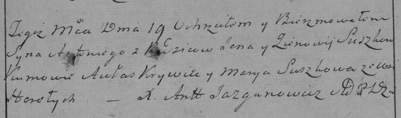

**Сушко Ян (Suszko Jan)**

19 января 1785 г -- крещение сына Антония (РГИА 823-2-18, лист 228,
№2/1785-р (коп)).

**РГИА 823-2-18:** Лист 228. **Метрическая запись №2/1785-р (коп).**

{width="6.496527777777778in"
height="1.91875in"}

Дедиловичская Покровская церковь. 19 января 1785 года. Метрическая
запись о крещении.

Suszko Antoni -- сын родителей с деревни Горелое.

Suszko Jan -- отец.

Suszkowa Zienowia -- мать.

Krywiec Aułas -- кум.

Suszkowa Marya - кума.

Jazgunowicz Antoni -- ксёндз.
