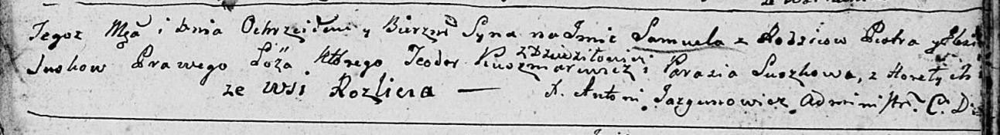

**Сушко Параскевия (Suszkowa Parasia)**

26 декабря 1787 г -- крещение дочери Евы (НИАБ 136-13-894, лист 3об,
№65/1787-р (об)), (РГИА 823-2-18, лист 235, №34/1787-р (коп)).

13 июля 1791 г -- крещение сына Мацея (НИАБ 136-13-894, лист 13об,
№30/1791-р (об)), (РГИА 823-2-18, лист 242, №16/1791-р (коп)).

23 октября 1799 г -- возможно, крестная мать Текли, дочери Бавтруков
Грыгора и Текли с деревни Нивки (НИАБ 136-13-894, лист 39об, №41/1799-р
(об)).

23 октября 1799 г -- возможно, крестная мать Самуэля, сына Сушков Петра
и Елеси с деревни Разлитье (НИАБ 136-13-894, лист 40, №43/1799-р
(ориг)).

27 ноября 1804 г -- возможно, крестная мать Настасьи Текли, дочери
Сушков Самуэля и Марыи с деревни Горелое (НИАБ 136-13-894, лист 55об,
№56/1804-р (ориг)).

**НИАБ 136-13-894:** Лист 3об. **Метрическая запись №65/1787-р (ориг).**

Дедиловичская Покровская церковь. 26 декабря 1787 года. Метрическая
запись о крещении.

Suszkowna Ewa -- дочь родителей с деревни Горелое.

Suszko Janka -- отец.

Suszkowa Parasia -- мать.

Suszko Awłas - кум.

Suszkowa Maryia - кума.

Jazgunowicz Antoniusz -- ксёндз.

**РГИА 823-2-18:** Лист 235. **Метрическая запись №34/1787-р (коп).**

Дедиловичская Покровская церковь. 26 декабря 1787 года. Метрическая
запись о крещении.

Suszkowa Ewa -- дочь родителей с деревни Горелое.

Suszko Jan -- отец.

Suszkowa Parasia -- мать.

Suszko Aułas -- кум.

Suszkowa Marya - кума.

Jazgunowicz Antoni -- ксёндз.

**НИАБ 136-13-894:** Лист 13об. **Метрическая запись №30/1791-р
(ориг).**

Дедиловичская Покровская церковь. 13 июля 1791 года. Метрическая запись
о крещении.

Suszko Maciey -- сын родителей с деревни Горелое.

Suszko Janka -- отец.

Suszkowa Parasia -- мать.

Suszko Stefan - кум.

Sawiczowa Maryia - кума.

Jazgunowicz Antoni -- ксёндз.

**РГИА 823-2-18:** Лист 242. **Метрическая запись №16/1791-р (коп).**

Дедиловичская Покровская церковь. 13 июля 1791 года. Метрическая запись
о крещении.

Suszko Maciey -- сын родителей с деревни Горелое.

Suszko Jan -- отец.

Suszkowa Parasia -- мать.

Suszko Stefan -- кум.

Sawiczowa Marya - кума.

Jazgunowicz Antoni -- ксёндз.

Лист 39об. **Метрическая запись №41/1799-р (ориг).**

Дедиловичская Покровская церковь. 23 октября 1799 года. Метрическая
запись о крещении.

Baurukowna Tekla -- дочь родителей с деревни Нивки.

Bauruk Hryhor -- отец.

Bauruk Natalla -- мать.

? Mikołay -- кум с деревни Горелое.

Suszkowa Parasia -- кума с деревни Горелое.

Jazgunowicz Antoni -- ксёндз.

Лист 40. **Метрическая запись №43/1799-р (ориг).**

Дедиловичская Покровская церковь. 23 октября 1799 года. Метрическая
запись о крещении.

Suzsko Samuel -- сын родителей с деревни Разлитье.

Suzsko Piotr -- отец.

Suzsko Elżbieta -- мать.

Kuszniarewicz Teodor -- кум, с деревни Дедиловичи.

Suszkowa Parasia -- кума, с деревня Горелое.

Jazgunowicz Antoni -- ксёндз.

**НИАБ 136-13-894:** Лист 55об. **Метрическая запись №56/1804-р
(ориг).**

Дедиловичская Покровская церковь. 27 ноября 1804 года. Метрическая
запись о крещении.

Suszkowna Nastazya Tekla -- дочь родителей с деревни Горелое.

Suszko Samuel -- отец.

Suszkowa Maryia -- мать.

Suszko Jhnat -- кум, с деревни Горелое.

Suszkowa Parasia -- кума, с деревни Горелое.

Jazgunowicz Antoni -- ксёндз.
