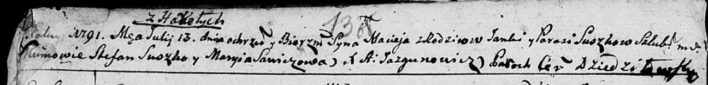

**Сушко Ян (Suszko Janka)**

26 декабря 1787 г -- крещение дочери Евы (НИАБ 136-13-894, лист 3об,
№65/1787-р (об)), (РГИА 823-2-18, лист 235, №34/1787-р (коп)).

13 июля 1791 г -- крещение сына Мацея (НИАБ 136-13-894, лист 13об,
№30/1791-р (об)), (РГИА 823-2-18, лист 242, №16/1791-р (коп)).

**НИАБ 136-13-894:** Лист 3об. **Метрическая запись №65/1787-р (ориг).**

{width="6.496527777777778in"
height="1.1150503062117236in"}

Дедиловичская Покровская церковь. 26 декабря 1787 года. Метрическая
запись о крещении.

Suszkowna Ewa -- дочь родителей с деревни Горелое.

Suszko Janka -- отец.

Suszkowa Parasia -- мать.

Suszko Awłas - кум.

Suszkowa Maryia - кума.

Jazgunowicz Antoniusz -- ксёндз.

**РГИА 823-2-18:** Лист 235. **Метрическая запись №34/1787-р (коп).**

{width="6.496527777777778in"
height="1.7486111111111111in"}

Дедиловичская Покровская церковь. 26 декабря 1787 года. Метрическая
запись о крещении.

Suszkowa Ewa -- дочь родителей с деревни Горелое.

Suszko Jan -- отец.

Suszkowa Parasia -- мать.

Suszko Aułas -- кум.

Suszkowa Marya - кума.

Jazgunowicz Antoni -- ксёндз.

**НИАБ 136-13-894:** Лист 13об. **Метрическая запись №30/1791-р
(ориг).**

{width="6.496527777777778in"
height="0.7818099300087489in"}

Дедиловичская Покровская церковь. 13 июля 1791 года. Метрическая запись
о крещении.

Suszko Maciey -- сын родителей с деревни Горелое.

Suszko Janka -- отец.

Suszkowa Parasia -- мать.

Suszko Stefan - кум.

Sawiczowa Maryia - кума.

Jazgunowicz Antoni -- ксёндз.

**РГИА 823-2-18:** Лист 242. **Метрическая запись №16/1791-р (коп).**

{width="6.496527777777778in"
height="1.6770833333333333in"}

Дедиловичская Покровская церковь. 13 июля 1791 года. Метрическая запись
о крещении.

Suszko Maciey -- сын родителей с деревни Горелое.

Suszko Jan -- отец.

Suszkowa Parasia -- мать.

Suszko Stefan -- кум.

Sawiczowa Marya - кума.

Jazgunowicz Antoni -- ксёндз.
