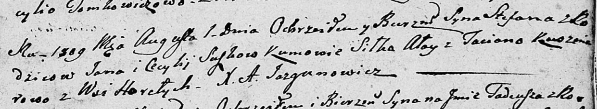

**Сушко Степан Янов (Suszko Stefan)**

1 августа 1809 г -- крещение (НИАБ 136-13-894, лист 75, №37/1809-р
(об)).

**НИАБ 136-13-894:** Лист 75. **Метрическая запись №37/1809-р (ориг).**

{width="6.496527777777778in"
height="1.1934995625546807in"}

Дедиловичская Покровская церковь. 1 августа 1809 года. Метрическая
запись о крещении .

Suszko Stefan -- сын родителей с деревни Горелое.

Suszko Jan -- отец.

Suszkowa Cecylija -- мать.

Ałay Siłko -- кум.

Kuszniarowa Taciana -- кума.

Jazgunowicz Antoni -- ксёндз.
