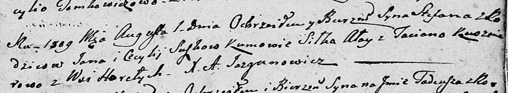

**Сушко Цецылия (Suszkowa Cecylia)**

12 мая 1807 г --крестная мать Хведора, сына Сушков Савы и Ксени с
деревни Разлитье (НИАБ 136-13-894, лист 62об, №25/1807-р (ориг)).

1 августа 1809 г -- крещение сына Степана (НИАБ 136-13-894, лист 75,
№37/1809-р (об)).

**НИАБ 136-13-894:** Лист 62об. **Метрическая запись №25/1807-р
(ориг).**

Дедиловичская Покровская церковь. 12 мая 1807 года. Метрическая запись о
крещении.

Suszko Chwiedor -- сын родителей с деревни Разлитье.

Suszko Sauka -- отец.

Suszkowa Xienia -- мать.

Suszko Jakub -- кум, с деревни Горелое.

Suszkowa Cecylia -- кума, с деревни Горелое.

Jazgunowicz Antoni -- ксёндз.

**НИАБ 136-13-894:** Лист 75. **Метрическая запись №37/1809-р (ориг).**

Дедиловичская Покровская церковь. 1 августа 1809 года. Метрическая
запись о крещении .

Suszko Stefan -- сын родителей с деревни Горелое.

Suszko Jan -- отец.

Suszkowa Cecylija -- мать.

Ałay Siłko -- кум.

Kuszniarowa Taciana -- кума.

Jazgunowicz Antoni -- ксёндз.
