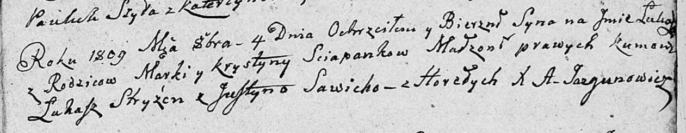

**Сцяпанка Лука Марков (Sciapanka Łukasz)**

4 октября 1809 г -- крещение (НИАБ 136-13-894, лист 74, №15/1809-р
(ориг)).

**НИАБ 136-13-894:** Лист 74. **Метрическая запись №15/1809-р (ориг).**

{width="6.496527777777778in"
height="1.2672550306211723in"}

Дедиловичская Покровская церковь. 4 октября 1809 года. Метрическая
запись о крещении .

Sciapanka Łukasz -- сын родителей с деревни Горелое.

Sciapanka Marko -- отец.

Sciapankowa Krystyna -- мать.

Stryżeń Łukasz -- кум.

Sawicka Justyna -- кума.

Jazgunowicz Antoni -- ксёндз.
