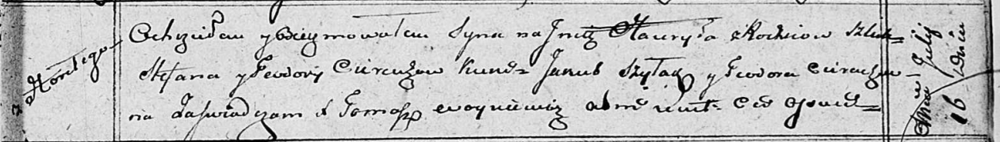

**Церах Гаврыла Степанов (Cierach Hauryła)**

16 июля 1810 г -- крещение (НИАБ 136-13-894, лист 78, №29/1810-р
(ориг)).

**НИАБ 136-13-894:** Лист 78. **Метрическая запись №29/1810-р (ориг).**

Осовская Покровская церковь. 16 июля 1810 года. Метрическая запись о
крещении.

Cierach Hauryła -- сын родителей с деревни Горелое.

Cierach Stefan -- отец.

Cierachowa Teodora -- мать.

Szyłak Jakub -- кум.

Cierachowa Teodora -- кума.

Woyniewicz Tomasz -- ксёндз.
