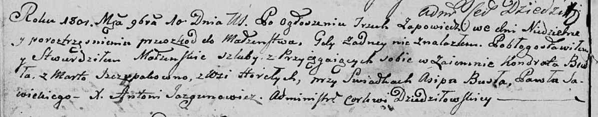

**Бусел (Шчыпак) Марта (Busłowa (Szczypakowna) Marta)**

10 ноября 1801 г -- венчание с Кондратом Буслом (НИАБ 136-13-920, лист
7об, №5/1801-б (ориг)).

**НИАБ 136-13-920:** Лист 7об. **Метрическая запись №5/1801-б (ориг).**

Дедиловичская Покровская церковь. 10 ноября 1801 года. Метрическая
запись о венчании.

Busła Kondrat -- жених.

Szczypakowna Marta -- невеста, с деревни Горелое.

Busła Asip -- свидетель.

Sawicki Paweł -- свидетель.

Jazgunowicz Antoni -- ксёндз.
