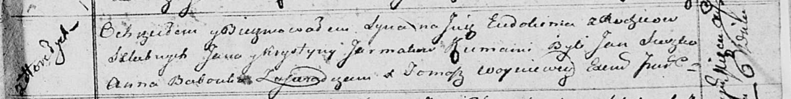
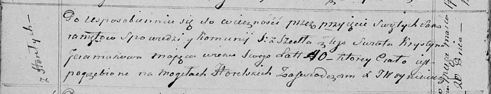

**Ярмак Крыстына (Jarmakowa, Jeramakowa Krystyna)**

6 августа 1813 г -- крещение сына Евдокима (НИАБ 136-13-894, лист 87,
№25/1813-р (ориг)).

20 марта 1820 г -- отпевание, умерла в возрасте 40 лет (родилась около
1775 г) (НИАБ 136-13-919, лист 28об, №7/1815-у (ориг)).

**НИАБ 136-13-894:** Лист 87. **Метрическая запись №25/1813-р (ориг).**

Осовская Покровская церковь. 6 августа 1813 года. Метрическая запись о
крещении.

Jarmak Eudokim -- сын родителей с деревни Горелое.

Jarmak Jan -- отец.

Jarmakowa Krystyna -- мать.

Suszko Jan -- кум.

Babouka Anna -- кума.

Woyniewicz Tomasz -- ксёндз.

**НИАБ 136-13-919:** Лист 28об. **Метрическая запись №7/1815-у (ориг).**

Осовская униатская церковь. 20 марта 1815 года. Метрическая запись об
отпевании.

Jeramakowa Krystyna -- умершая, 40 лет, с деревни Горелое, похоронена на
кладбище деревни Горелое.

Woyniewicz Tomasz -- ксёндз.
