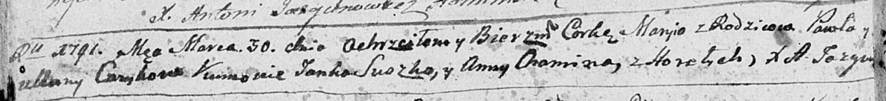

**? Балтромей (? Bałtromiey Tadeusz)**

28 августа 1804 г -- крещение сына Балтромея Тадеуша (НИАБ 136-13-894,
лист 54об, №33/1804-р (ориг)).

**НИАБ 136-13-894:** Лист 54об. **Метрическая запись №33/1804-р
(ориг).**

{width="6.496527777777778in"
height="1.1103576115485565in"}

Дедиловичская Покровская церковь. 28 августа 1804 года. Метрическая
запись о крещении.

Baltromey Tadeusz -- сын родителей с деревни Горелое.

Suszko Hryhor -- кум.

Suszkowa Maryia -- кума.

Jazgunowicz Antoni -- ксёндз.
