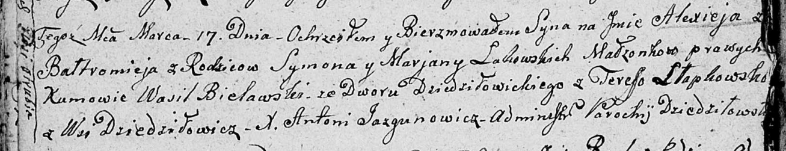

**Белявский Василь (Bielawski Wasil)**

17 марта 1807 г -- крестный отец у Алексея Балтромея, сына Ластовских
Сымона и Марьяны с деревни Отруб (НИАБ 136-13-894, лист 62об, №18/1807-р
(ориг)).

**НИАБ 136-13-894:** Лист 62об. **Метрическая запись №18/1807-р
(ориг).**

Дедиловичская Покровская церковь. 17 марта 1807 года. Метрическая запись
о крещении.

Ła\[st\]owski Alexiey Bałtromiey -- сын родителей с деревни Отруб.

Ła\[st\]owski Symon -- отец.

Ła\[st\]owska Marjana -- мать.

Bielawski Wasil -- кум, со двора Дедиловичского.

Słapkowska Teresa -- кума, с деревня Дедиловичи.

Jazgunowicz Antoni -- ксёндз.
