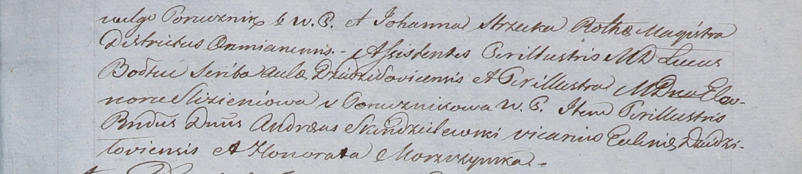

**Болтец? Лукаш (Bołtiec? Łukasz)**

9 февраля 1808 г -- крестный отец Иоанны Изабеллы, дочери Петра и
Магдалены Мощинских со двора Дедиловичи (НИАБ 937-4-32, лист 17об,
№6/1808-р).

**НИАБ 937-4-32:** Лист 17об-18. **Метрическая запись №6/1808-р.**

{width="6.496527777777778in"
height="1.4930555555555556in"}

{width="6.496527777777778in"
height="1.413888888888889in"}

Дедиловичский костел Наисвятейшего Сердца Иисуса. 9 февраля 1808 года.
Метрическая запись о крещении.

Moszczynska Joanna Jsabełła -- дочь шляхтичей со двора Дедиловичи.

Moszczynski Petro -- отец, эконом Дедиловичский.

Moszczynska Magdalena z Antorzkiewiczow -- мать.

Slizień Benedict -- крестный отец, шляхтич.

Strzuka Johanna -- крестная мать, шляхтянка.

Bołtiec? Łucasz -- ассистент, шляхтич, со двора Дедиловичи.

Slizieniowa Eleonora z Gonuznikow -- ассистентка, шляхтянка.

Skindzelewski Andreas -- ассистент, викарий Дедиловичский.

Moszczynska Honorata -- ассистентка, шляхтянка.

Zychowski Gabriel -- ксёндз.
