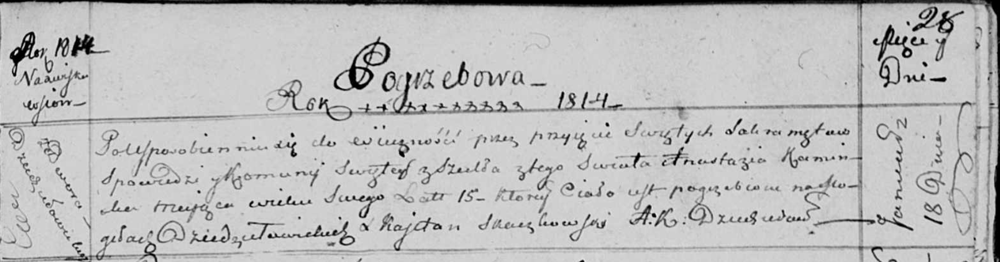

**Каминская Анастасия (Kaminska Anastazia)**

18 января 1814 г -- отпевание, умерла в возрасте 15 лет (родилась около
1799 г) (НИАБ 136-13-919, лист 28, №1/1814-у (ориг)).

**НИАБ 136-13-919:** Лист 28. **Метрическая запись №1/1814-у (ориг).**

Осовская униатская церковь. 18 января 1814 года. Метрическая запись об
отпевании.

Kaminska Anastazia -- умершая, 15 лет, с двора Дедиловичи, похоронена на
кладбище деревни Дедиловичи.

Woyniewicz Tomasz -- ксёндз.
