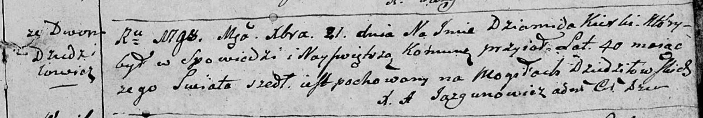

**Керко Демид (Kierko Dziamid)**

21 декабря 1789 г -- отпевание, умер в возрасте 40 лет (родился около
1758 г) (НИАБ 136-13-919, лист 8, №19/1789-у (ориг)).

**НИАБ 136-13-919:** Лист 8. **Метрическая запись №19/1798-у (ориг).**

Дедиловичская Покровская церковь. 21 декабря 1798 года. Метрическая
запись об отпевании.

Kierko Dziamid -- умерший, 40 лет, с двора Дедиловичи, похоронен на
кладбище деревни Дедиловичи.

Jazgunowicz Antoni -- ксёндз.
