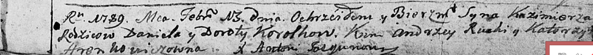
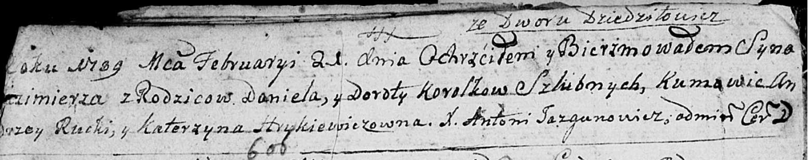
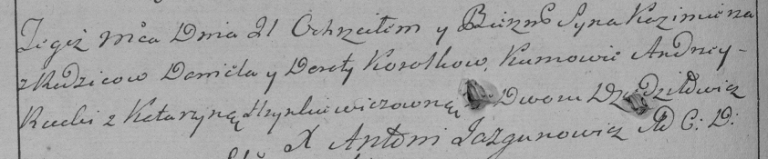

**Королёк Казимир Данилов (Koroliok Kazimerz)**

21 февраля 1789 г -- крещение сына Казимира (НИАБ 136-13-894, лист 6,
6об, №№10-доп, 10/1789-р (ориг)), (РГИА 823-2-18, лист 237об, №7/1789-р
(коп)).

**НИАБ 136-13-894:** Лист 6. **Метрическая запись №10-доп/1789-р
(ориг).**

Дедиловичская Покровская церковь. 13 февраля 1789 года. Метрическая
запись о крещении. См. следующую запись.

Koroliok Kazimierz - сын.

Koroliok Daniel -- отец.

Korolkowa Dorota -- мать.

Rucki Andrzej - кум.

Arenkowiczowna Katerzyna - кума.

Jazgunowicz Antoni -- ксёндз.

**НИАБ 136-13-894:** Лист 6об. **Метрическая запись №10/1789-р (ориг).**

Дедиловичская Покровская церковь. 21 февраля 1789 года. Метрическая
запись о крещении. См. тж. **Метрическая запись №10-доп/1789-р (ориг).**

Koroliok Kaźimierz -- сын родителей со двора Дедиловичи .

Koroliok Daniel -- отец.

Korolkowa Dorota -- мать.

Rucki Andrzey - кум.

Hrykiewiczowna Katerzyna - кума.

Jazgunowicz Antoni -- ксёндз.

**РГИА 823-2-18:** Лист 237об. **Метрическая запись №7/1789-р (коп).**

Дедиловичская Покровская церковь. 21 февраля 1789 года. Метрическая
запись о крещении.

Korolok Kazimierz -- сын родителей со двора Дедиловичи.

Korolok Daniel -- отец.

Korolkowa Dorota -- мать.

Rucki Andrzey -- кум.

Hrynkiewiczowna Katarzyna - кума.

Jazgunowicz Antoni -- ксёндз.
