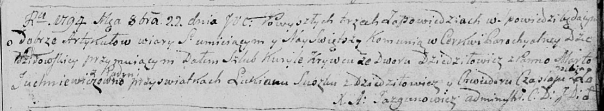

**Кривец Курыла (Krywiec Kuryła)**

22 октября 1794 г -- венчание с Мартой Юхневич с деревни Пядань (НИАБ
136-13-920, лист 1, №7/1794-б (ориг)).

**НИАБ 136-13-920:** Лист 1. **Метрическая запись №7/1794-б (ориг).**

{width="6.496527777777778in"
height="1.2055686789151356in"}

Дедиловичская Покровская церковь. 22 октября 1794 года. Метрическая
запись о венчании.

Krywiec Kuryła -- жених, двор Дедиловичи.

Juchniewiczowna Marta -- невеста, деревня Пядань.

Suszko Łukian -- свидетель, деревня Дедиловичи.

Czaplay Chwiedor -- свидетель, деревня Отруб.

Jazgunowicz Antoni -- ксёндз.
