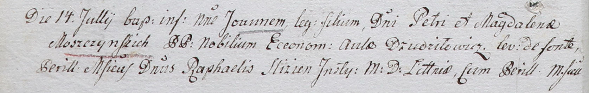
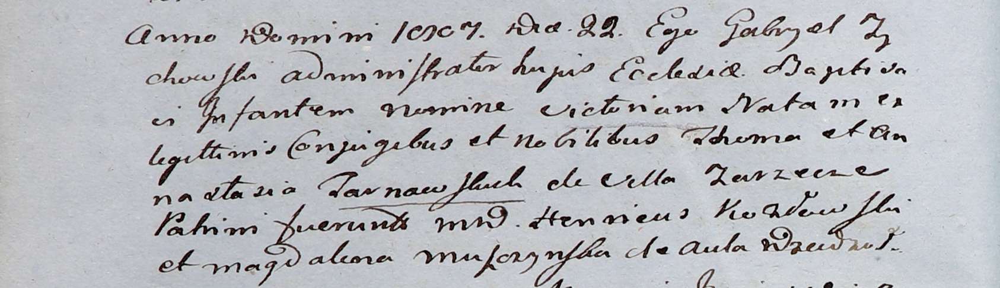
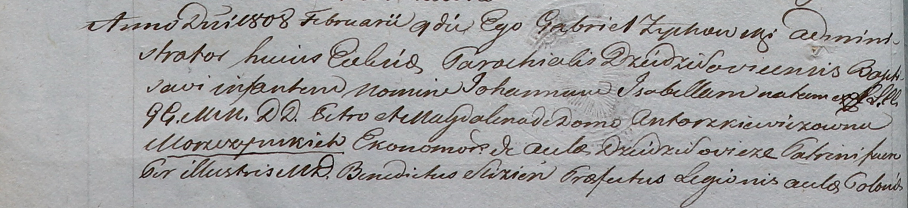

**Мощинская Магдалена (Moszynska Magdalena)**

30 сентября 1800 г -- крещение сына Петра Доминика (НИАБ 937-4-32, лист
3, №31/1800-р).

14 июля 1802 г -- крещение сына Иоанна (НИАБ 937-4-32, лист 6об,
№20/1802-р).

8 мая 1804 г -- крещение сына Якоба (НИАБ 937-4-32, лист 10,
№10/1804-р).

22 июня 1807 г -- крестная мать Виктории, дочери шляхтичей Томаша и
Анастасии Тарновских с деревни Заречье (НИАБ 937-4-32, лист 15об,
№10/1807-р).

9 февраля 1808 г -- крещение дочери Иоанны Изабеллы (НИАБ 937-4-32, лист
17об, №6/1808-р).

**НИАБ 937-4-32:** Лист 3. **Метрическая запись №31/1800-р.**

Дедиловичский костел Наисвятейшего Сердца Иисуса. 30 сентября 1800 года.
Метрическая запись о крещении.

Moszczynski Petrus Dominic -- сын шляхтичей со двора Дедиловичи.

Moszczynski Petrus -- отец, эконом Дедиловичский.

Moszczynska Dominica -- мать.

Simaszko Jgnati -- крестный отец, шляхтич.

Kuleszyna Thecla -- крестная мать, шляхтянка.

Bujewicz Michael - ассистент, шляхтич.

Czarnocka Justina - ассистентка, шляхтянка, девица.

Odyniec Romuald - ассистент, шляхтич.

Simaszkowa Dominica - ассистентка, шляхтянка.

Linhart Hyacinthus -- ксёндз.

**НИАБ 937-4-32:** Лист 6об-7. **Метрическая запись №20/1802-р.**

Дедиловичский костел Наисвятейшего Сердца Иисуса. 14 июля 1802 года.
Метрическая запись о крещении.

Moszczynski Joann -- сын шляхтичей с господского дома Дедиловичи.

Moszczynski Petrus -- отец, эконом двора Дедиловичского.

Moszczynska Magdalena -- мать.

Slizien Raphael -- крестный отец, шляхтич, инстигатор Литовский.

Slizieniowa Wilhelmina -- крестная мать, шляхтянка, маршалка
Борисовская.

Slizien Joseph - ассистент, шляхтич, маршалок Борисовский.

Kukiewiczowa Honorata - ассистентка, шляхтянка.

Tyszkiewicz Dominic -- ассистент, шляхтич.

Slizieniowna Thecla -- ассистентка, шляхтянка, маршалка Борисовская,
девица.

Linhart Hyacinthus -- ксёндз.

**НИАБ 937-4-32:** Лист 10. **Метрическая запись №10/1804-р.**

Дедиловичский костел Наисвятейшего Сердца Иисуса. 8 мая 1804 года.
Метрическая запись о крещении.

Moszczynski Jakob -- сын шляхтичей со двора Дедиловичи.

Moszczynski Piotr -- отец, эконом Дедиловичский.

Moszczynska Magdalena -- мать.

Slizien Rafael -- крестный отец, шляхтич, инстигатор Литовский.

Czarnocka Victoria -- крестная мать, шляхтянка.

Thomaszewski Joseph - ассистент, шляхтич.

Galinowski Joann -- ксёндз, комендант Дедиловичского костела.

**НИАБ 937-4-32:** Лист 15об. **Метрическая запись №10/1807-р.**

Дедиловичский костел Наисвятейшего Сердца Иисуса. 22 июня 1807 года.
Метрическая запись о крещении.

Tarnowska Victoria -- дочь шляхтичей с деревни Заречье.

Tarnowski Thoma -- отец.

Tarnowska Anastazia -- мать.

Kozłowski Henricus -- крестный отец.

Moszczynska Magdalena -- крестная мать, со двора Дедиловичи.

Zychowski Gabriel -- ксёндз.

**НИАБ 937-4-32:** Лист 17об-18. **Метрическая запись №6/1808-р.**

Дедиловичский костел Наисвятейшего Сердца Иисуса. 9 февраля 1808 года.
Метрическая запись о крещении.

Moszczynska Joanna Jsabełła -- дочь шляхтичей со двора Дедиловичи.

Moszczynski Petro -- отец, эконом Дедиловичский.

Moszczynska Magdalena z Antorzkiewiczow -- мать.

Slizień Benedict -- крестный отец, шляхтич.

Strzuka Johanna -- крестная мать, шляхтянка.

Bołtiec? Łucasz -- ассистент, шляхтич, со двора Дедиловичи.

Slizieniowa Eleonora z Gonuznikow -- ассистентка, шляхтянка.

Skindzelewski Andreas -- ассистент, викарий Дедиловичский.

Moszczynska Honorata -- ассистентка, шляхтянка.

Zychowski Gabriel -- ксёндз.
