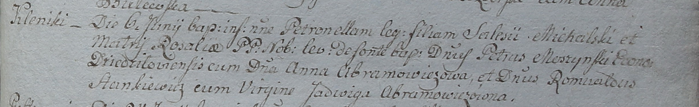

**Мощинский Пётр Петров (Moszynski Petrus Dominic)**

30 сентября 1800 г -- крещение (НИАБ 937-4-32, лист 3, №31/1800-р).

**НИАБ 937-4-32:** Лист 3. **Метрическая запись №31/1800-р.**

Дедиловичский костел Наисвятейшего Сердца Иисуса. 30 сентября 1800 года.
Метрическая запись о крещении.

{width="6.496527777777778in"
height="1.0930555555555554in"}

Moszczynski Petrus Dominic -- сын шляхтичей со двора Дедиловичи.

Moszczynski Petrus -- отец, эконом Дедиловичский.

Moszczynska Dominica -- мать.

Simaszko Jgnati -- крестный отец, шляхтич.

Kuleszyna Thecla -- крестная мать, шляхтянка.

Bujewicz Michael - ассистент, шляхтич.

Czarnocka Justina - ассистентка, шляхтянка, девица.

Odyniec Romuald - ассистент, шляхтич.

Simaszkowa Dominica - ассистентка, шляхтянка.

Linhart Hyacinthus -- ксёндз.
