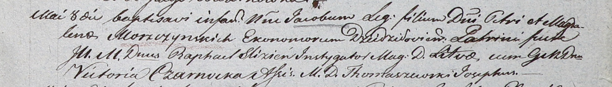

**Мощинский Якоб Петров (Moszynski Jakob)**

8 мая 1804 г -- крещение (НИАБ 937-4-32, лист 10, №10/1804-р).

**НИАБ 937-4-32:** Лист 10. **Метрическая запись №10/1804-р.**

Дедиловичский костел Наисвятейшего Сердца Иисуса. 8 мая 1804 года.
Метрическая запись о крещении.

Moszczynski Jakob -- сын шляхтичей со двора Дедиловичи.

Moszczynski Piotr -- отец, эконом Дедиловичский.

Moszczynska Magdalena -- мать.

Slizien Rafael -- крестный отец, шляхтич, инстигатор Литовский.

Czarnocka Victoria -- крестная мать, шляхтянка.

Thomaszewski Joseph - ассистент, шляхтич.

Galinowski Joann -- ксёндз, комендант Дедиловичского костела.
