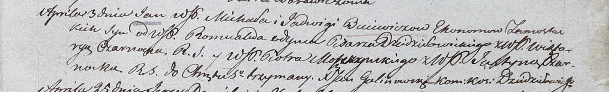

**Одынец Ромуальд (Odyniec Romuald)**

25 октября 1803 г -- крестный отец Ксаверия, сына Винцентия и Иоханны
Арцишевских с деревни Осово (НИАБ 937-4-32, лист 9об, №26/1803-р).

3 апреля 1804 г -- крестный отец Яна, сына шляхтичей Михала и Ядвиги
Буевичей со двора Замосточье (НИАБ 937-4-32, лист 10, №6/1804-р).

**НИАБ 937-4-32:** Лист 9об. **Метрическая запись №26/1803-р.**

{width="6.496527777777778in"
height="1.1513888888888888in"}

Дедиловичский костел Наисвятейшего Сердца Иисуса. 25 октября 1803 года.
Метрическая запись о крещении.

Arciszewski Xawery -- сын шляхтичей с деревни Осово.

Arciszewski Wincenty -- отец.

Arciszewska Joanna -- мать.

Odyniec Romuald -- крестный отец, шляхтич, писарь Дедиловичский.

Czarnocka Justyna -- крестная мать, шляхтянка, ротмистрова Смоленского.

Buiewicz Michał - ассистент, шляхтич, эконом Замосточский.

Chodasewiczowa Magdalena - ассистентка, шляхтянка.

Czarnocki Jozef - ассистент, шляхтич.

Michalska Rozalia - ассистентка, шляхтянка.

Galinowski Joann -- ксёндз, комендант Дедиловичского костела.

**НИАБ 937-4-32:** Лист 10. **Метрическая запись №6/1804-р.**

{width="6.496527777777778in"
height="0.9902777777777778in"}

Дедиловичский костел Наисвятейшего Сердца Иисуса. 3 апреля 1804 года.
Метрическая запись о крещении.

Buiewicz Jan -- сын шляхтичей со двора Замосточье.

Buiewicz Michał -- отец, эконом Замосточский.

Buiewiczowa Jadwiga -- мать.

Odyniec Romuald -- крестный отец, шляхтич, писарь Дедиловичский.

Czarnocka Wiktorya -- крестная мать, шляхтянка.

Moszczynski Piotr - ассистент, шляхтич.

Czarnocka Justyna - ассистентка, шляхтянка.

Galinowski Joann -- ксёндз, комендант Дедиловичского костела.
