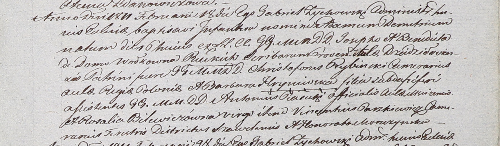

**Пясецкий Антон (Piasecki Antoni)**

18 февраля 1811 г -- ассистент при крещении Адама Дмитрия, сына
шляхтичей Иосифа и Бенедикты Руцких со двора Дедиловичи (НИАБ 937-4-32,
лист 23, №3/1811-р).

**НИАБ 136-13-920:** Лист 23. **Метрическая запись №3/1811-р.**

{width="6.496527777777778in"
height="1.9013888888888888in"}

Дедиловичский костел Наисвятейшего Сердца Иисуса. 18 февраля 1811 года.
Метрическая запись о крещении.

Rucki Adam Demetri -- сын шляхтичей со двора Дедиловичского.

Rucki Joseph -- отец, писарь.

Rucka Benedicta z Wołkowych -- мать.

Rybinski Christophorus -- крестный отец, шляхтич, камергер Рижского
двора?.

Hryniewska Barbara -- крестная мать, шляхтянка, ?.

Piasecki Antonius - ассистент, шляхтич, со двора Мстижского.

Bilewiczowna Rosalia - ассистентка, шляхтянка, девица.

Paszkiewicz Vincentius - ассистент, шляхтич, камергер ?.

Moszczynska Honorata - ассистентка, шляхтянка.

Zychowski Gabriel -- ксёндз.
