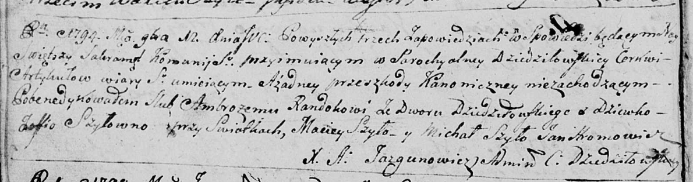

**Рандак (Шило) Софья (Randakowa Zofia z Szył)**

12 ноября 1794 г -- венчание с Амброзием Рандаком со двора Дедиловичи
(НИАБ 136-13-920, лист 1об, №13/1794-б (ориг)).

**НИАБ 136-13-920:** Лист 1об. **Метрическая запись №13/1794-б (ориг).**

{width="6.496527777777778in"
height="1.7144827209098863in"}

Дедиловичская Покровская церковь. 12 ноября 1794 года. Метрическая
запись о венчании.

Randak Ambrozy -- жених, двор Дедиловичи.

Szyłowna Zofia -- невеста, девка.

Szyło Maciey -- свидетель.

Szyło Michał -- свидетель.

Hromowicz Jan -- свидетель.

Jazgunowicz Antoni -- ксёндз.
