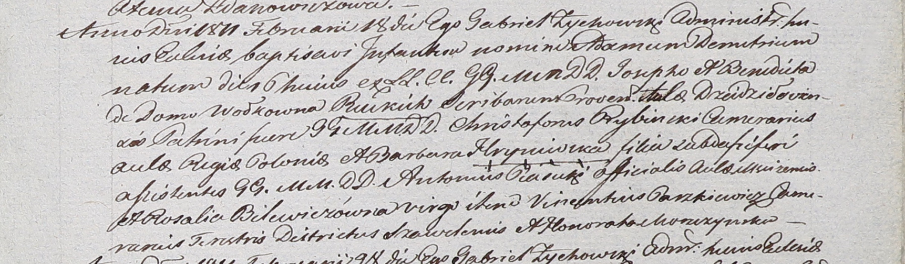
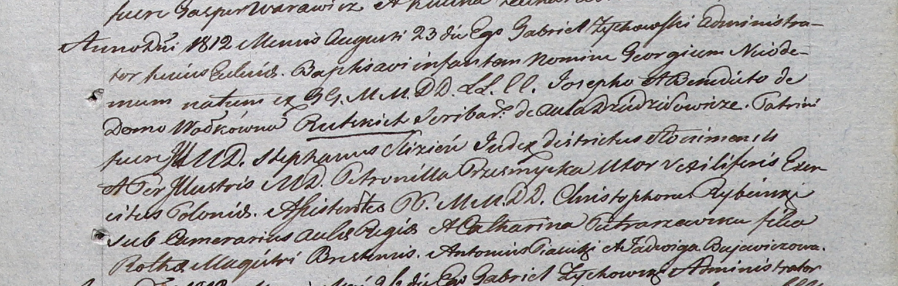

**Руцкая (Волкова) Бенедикта (Rucka, Rutcka Benedicta z Wołkowych)**

18 февраля 1811 г -- крещение сына Адама Дмитрия (НИАБ 937-4-32, лист
23, №3/1811-р).

23 августа 1812 г -- крещение сына Георгий Никодим (НИАБ 937-4-32, лист
24, №5/1812-р).

**НИАБ 136-13-920:** Лист 23. **Метрическая запись №3/1811-р.**

Дедиловичский костел Наисвятейшего Сердца Иисуса. 18 февраля 1811 года.
Метрическая запись о крещении.

Rucki Adam Demetri -- сын шляхтичей со двора Дедиловичского.

Rucki Joseph -- отец, писарь.

Rucka Benedicta z Wołkowych -- мать.

Rybinski Christophorus -- крестный отец, шляхтич, камергер Рижского
двора?.

Hryniewska Barbara -- крестная мать, шляхтянка, ?.

Piasecki Antonius - ассистент, шляхтич, со двора Мстижского.

Bilewiczowna Rosalia - ассистентка, шляхтянка, девица.

Paszkiewicz Vincentius - ассистент, шляхтич, камергер ?.

Moszczynska Honorata - ассистентка, шляхтянка.

Zychowski Gabriel -- ксёндз.

**НИАБ 937-4-32:** Лист 24. **Метрическая запись №5/1812-р.**

Дедиловичский костел Наисвятейшего Сердца Иисуса. 23 августа 1812 года.
Метрическая запись о крещении.

Rutcki Georgius Nicodimus -- сын шляхтичей со двора Дедиловичи.

Rutcki Joseph -- отец, писарь Дедиловичский.

Rutcka Benedicta z Wołkowych -- мать.

Slizien Stephan -- крестный отец, шляхтич, ? Слонимский.

Przesmycka Petronilla -- крестная мать, шляхтянка.

Rybinski Christophor - ассистент, шляхтич.

Pietrorzewska Catharina - ассистентка, шляхтянка.

Piasecki Antoni - ассистент, шляхтич.

Buiewiczowa Jadwiga - ассистентка, шляхтянка.

Zychowski Gabriel -- ксёндз.
