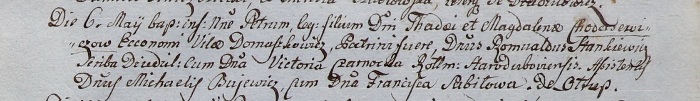

**Станкевич Ромуальд (Stankiewicz Romuald)**

6 мая 1800 г -- крестный отец Петра, сына шляхтичей Тадея и Магдалены
Ходасевичей с деревни Домашковичи (НИАБ 937-4-32, лист 2, №14/1800-р).

**НИАБ 937-4-32:** Лист 2. **Метрическая запись №14/1800-р.**

{width="6.496527777777778in"
height="0.9465277777777777in"}

Дедиловичский костел Наисвятейшего Сердца Иисуса. 6 мая 1800 года.
Метрическая запись о крещении.

Chodasewicz Petrus -- сын шляхтичей с двора Домашковичи.

Chodasewicz Thadei -- отец, эконом двора Домашковичи.

Chodasewiczowa Magdalena -- мать.

Stankiewicz Romuald -- крестный отец, шляхтич с двора Дедиловичи.

Czarnocka Victoria -- крестная мать, шляхтянка, жена ротмистра
Стародубского.

Bujewicz Michael -- ассистент, шляхтич.

Sabiłowa Francisca -- ассистентка, шляхтянка, с деревни Отруб.

Linhart Hyacinthus -- ксёндз.
